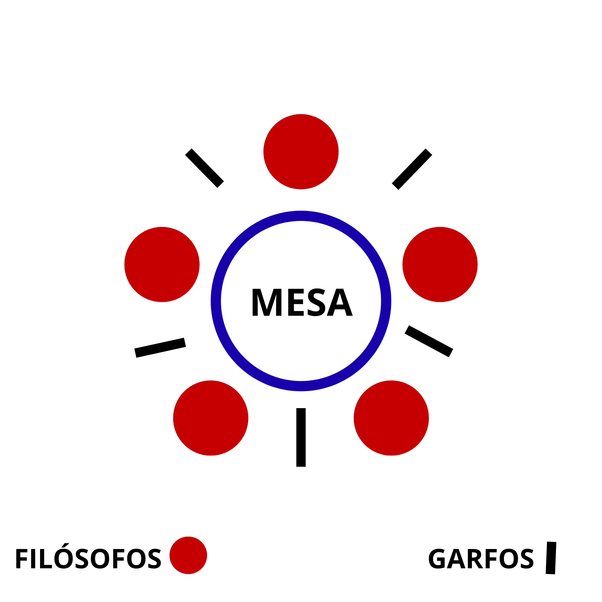
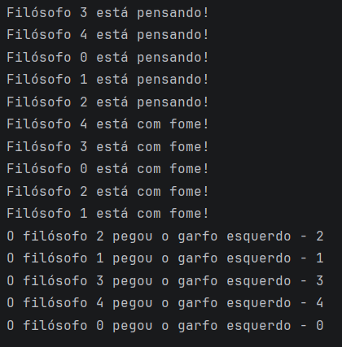

# PARTE 1: JANTAR DOS FILÓSOFOS

## 1. Objetivo
O objetivo desta atividade é implementar uma solução para o
clássico problema do jantar dos filósofos. Entender como
uma solução ingênua pode gerar deadlock (Condição de Coffman)
e como uma solução baseada em hierarquia de recursos (threads
e semáforos) pode garantir um bom resultado.

## 2. Descrição do Problema
Cinco filósofos estão sentados ao redor de uma mesa
circular. Cada filósofo alterna entre pensar e comer.
Para comer, um filósofo precisa utilizar 
simultaneamente os dois garfos localizados à 
sua esquerda e à sua direita.
Como os garfos são compartilhados entre 
filósofos vizinhos, surge um problema de
concorrência envolvendo exclusão mútua, 
espera por recursos e possibilidade de impasse.

## 3. Representação da Mesa

*Mesa circular com 5 filósofos e 5 garfos*

## 4. Versão com Deadlock

### 4.1 Funcionamento
Todos os filósofos seguem o seguinte fluxo:
````
Pensar -> Pegar garfo a esquerda -> Pegar garfo a direita -> Comer -> Devolver os dois garfos.
````

### 4.2 Surgimento do Deadlock
O deadlock vai surgir quando todos os filósofos
conseguirem pegar o garfo da esquerda. Assim, gera-se
um ciclo infinito de espera pelo garfo da direita.
Os anexo abaixo representam visualmente e na prática a situação:

*Cada filósofo conseguiu pegar o garfo a esquerda*


*Cada filósofo pegou o garfo a esquerda e espera
o garfo a direita liberar*

## 5. Solução Aplicada

### 5.1 Funcionamento
A solução implementada utiliza hierarquia de 
recursos. Cada garfo recebe um identificador 
numérico e um semáforo, permitindo 1 uso por vez e
a ativação do modo de justiça. Todo filósofo 
é obrigado a adquirir primeiro o garfo 
de menor identificador e somente depois o 
garfo de maior identificador.

````java
if (esquerdo.getId() < direito.getId()) {
    primeiro = esquerdo;
    segundo = direito;
} else {
    primeiro = direito;
    segundo = esquerdo;
}
````

### 5.2 Condições de Coffman
São 4: `Exclusão Mútua, Manter e Esperar, 
Não Preempção e Espera Circular.`

Para entrar em deadlock, todas as condições devem
ser atendidas. Na solução implmentada, é resolvida
a condição de `espera circular`. Como todos os
filósofos seguem o fluxo (menor indíce ->
maior indíce) na aquisição de recursos, não é
possível formar um ciclo fechado de espera. Anulando
a possibilidade de Deadlock.


### 5.3 Garantias
Abaixo serão apresentadas as garantias de execução plena.

#### 5.3.1 Progresso
O progresso é garantido pois sempre que um filósofo
termina de comer, ele libera os dois garfos para os
demais. Como não existe espera circular, sempre um
filósofo consegue comer.

#### 5.3.1 Justiça
Foi utilizada a biblioteca `Semaphore` do java, da
seguinte maneira, na classe Garfo:
````java
new Semaphore(1, true);
````
*O parâmetro `1` ativa a simulação do recurso ser
utilizado somente um por vez. O parâmetro `true`,
ativa o modo fair, ou sej, semelhante ao FIFO,
atendendo com prioridade a ordem de chegada,
assim diminuindo a chance de inanição*

## 5.4 Fluxo de execução
````
Pensar -> Pegar garfo de menor indíce -> Pegar garfo de maior indíce -> Comer -> Devolver garfo de maior indíce -> Devolver garfo de menor indíce.
````

### 5.4.1 Execução


