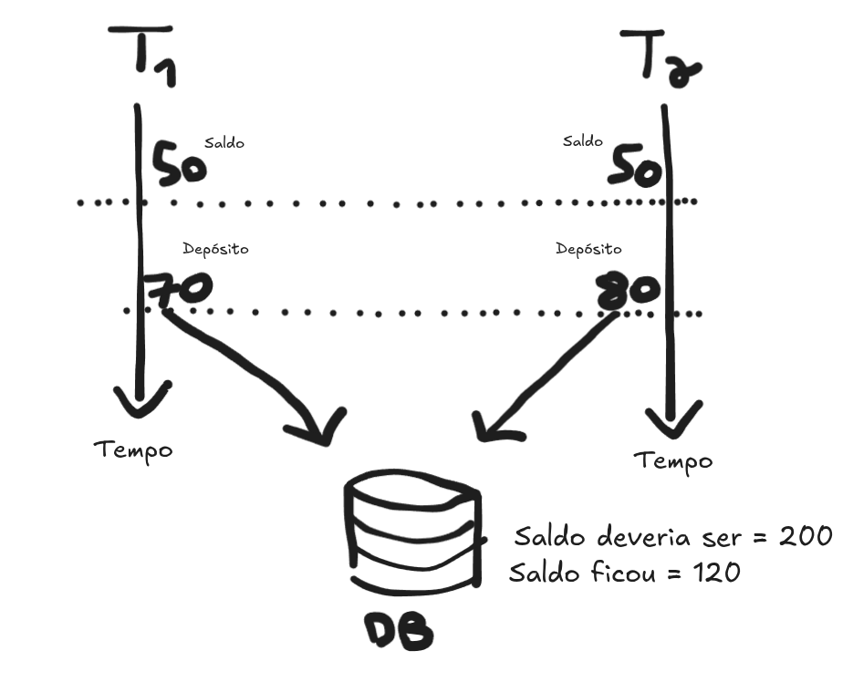
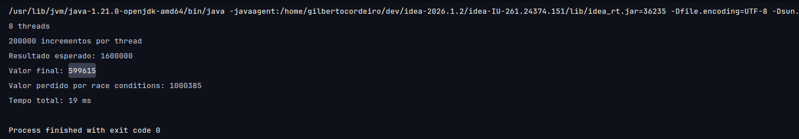
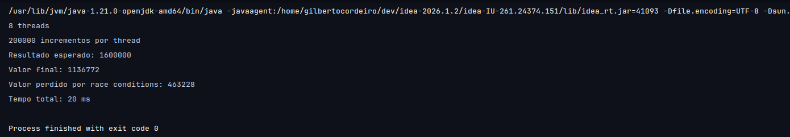
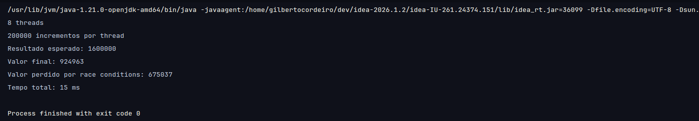
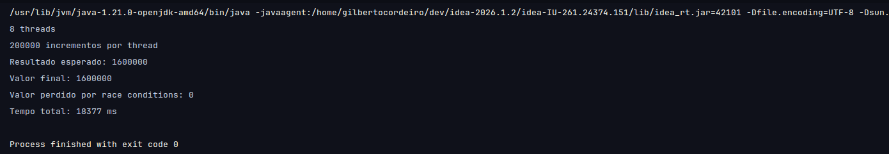
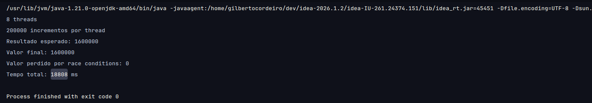
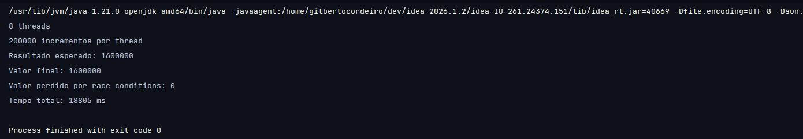
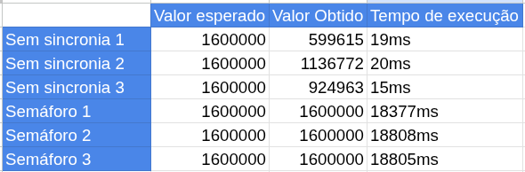

# Race condition solucionada com Semáforo

A versão sem sincronização perde incrementos por causa de race conditions, onde duas threads lêem o valor simultaneamente
de um recurso compartilhado, utilizando esse valor pra operação de incremento. A imagem abaixo (feita no excalidraw.com)
representa um caso onde duas Threads usam o mesmo valor de saldo lido simultaneamente, usando esse valor lido para incremento
do mesmo. No final, podemos observar que T2 executou a soma antes de T1, atualizando o saldo para 130, e depois T1 atualizou
o saldo para 120.

Para resolvermos esse problema, implementamos um semáforo binário, garantindo exclusão mútua, ou seja, uma Thread adquire
o semáforo por vez e executa o incremento isoladamente, e só depois outra Thread tem acesso à esse valor, já atualizado.
No diagrama abaixo vemos o mesmo cenário anterior, mas com um semáforo, garantindo que a Thread 1 execute toda sua operação
antes das Thread 2 conseguir consultar o valor.

#

No nosso código Java, o release() de t1 é visível antes de acquire() de t2

Em relação ao trade-off de Throughput, o semáforo visivelmente troca performance por correção(~17ms X ~18500ms), haja visto
que as threads ficam esperando o recurso ser liberado, e as ações de acquire e release têm custo.

# Execuções sem sincronia

# Execuções com semáforo

# Tabela de resultados

