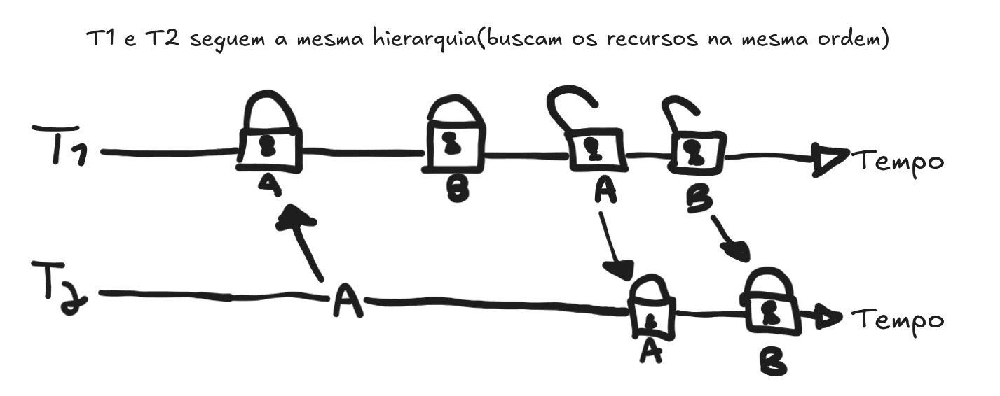
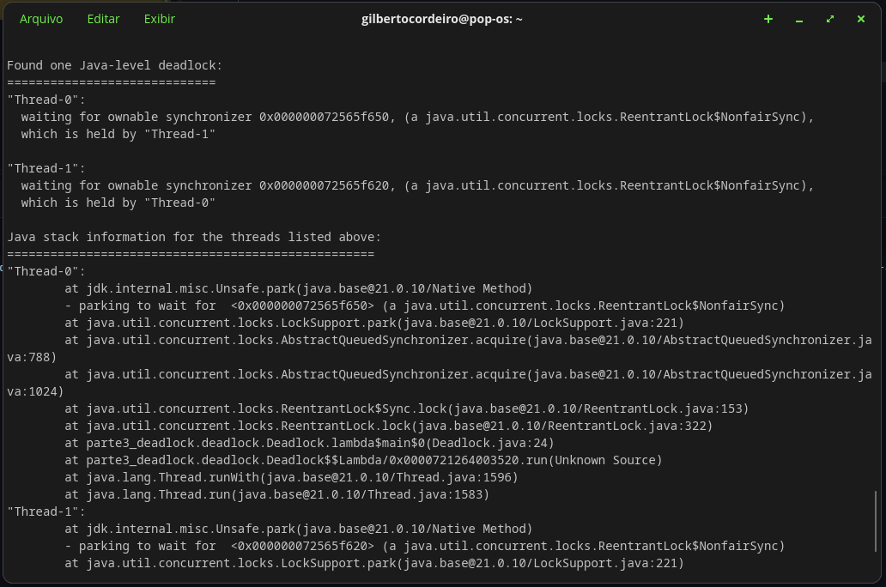
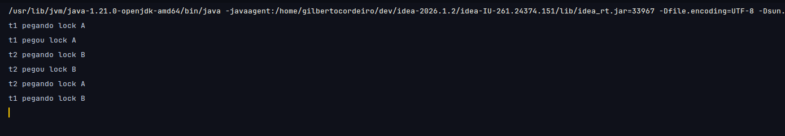

# Solução do deadlock
A solução utilizada implementa a estratégia de tratamento de prevenção, garantindo uma hierarquia de recursos igual
para ambas as threads, portanto, quebrando a condição de "Espera Circular", previnindo o deadlock. Na imagem anexada abaixo,
é possível interpretar melhor a execução do código considerando as duas threads em função do tempo percorrido.

Diagrama feito no excalidraw.com para representar a solução implementada

#

# Printscreen de logs

Printscreen do terminal após execução do comando jstack com o PID da classe Deadlock

#

Printscreen do terminal do IntelliJ indicando que o processo travou